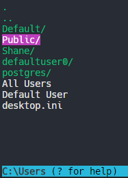
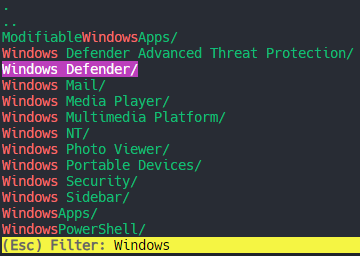

# Overview

tpick is a CLI file picker.

- Visually navigate the filesystem using keyboard navigation and filtering tools.
- Copy file paths to the clipboard.
- Print file paths to the terminal.

# Screenshots





# Installation

Check the [Releases](https://github.com/shanedonburke/tpick/releases/latest) page for the latest executables.

# Instructions

```
tpick - Terminal file picker

Usage: tpick [directory]

Arguments:
  [directory]   (Optional) Starting directory

Options:
  -h, --help    Show this help message and exit

Examples:
  tpick
  tpick /home/me
```